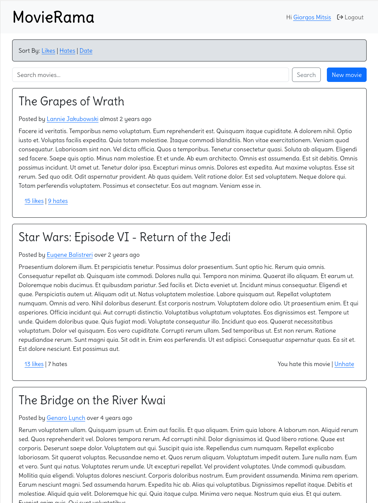

# README

This is a small project named **Movie Rama**. The application is (yet another) social sharing platform where users can share their favorite movies.

It's written in Ruby with Ruby on Rails using the Postgresql database



## Ruby version

3.3.3

## Configuration

### Prerequisites

In order to run the development environment you will need to have 
1. Ruby installed
2. Postgresql installed

#### Verify your current version of ruby is `3.3.3` with

```
ruby -v
```

#### Install Postgresql related stuff

MacOS

```
brew install libpq
brew install postgresql
```

Make sure that postgres is running on port 5432 

> you may need to uncomment the port line in `/usr/local/var/posgresql@14/postgresql.conf` and restart the server with `brew services restart postgresql`)

### Project configuration

#### Install gems

```
bundle install
```

#### Create database

```
bundle exec rails db:create
```

#### Run database migrations

```
bundle exec rails db:migrate
```

#### Fill database with some dummy data 

```
bundle exec rails db:seed
```

This may take some time. You can alter the number of dummy users, movies and votes in `db/seeds.rb`

## How to run the project in development

#### Just run

```
bundle exec rails s
```

#### and visit app in `localhost:3000`

## How to run the test suite

#### Just run this command to run the whole test suite

```
bundle exec rspec
```
